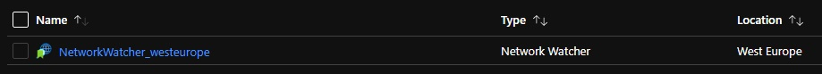
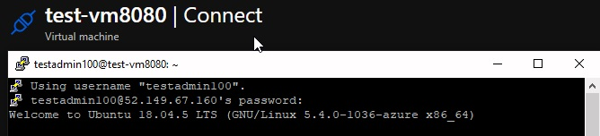
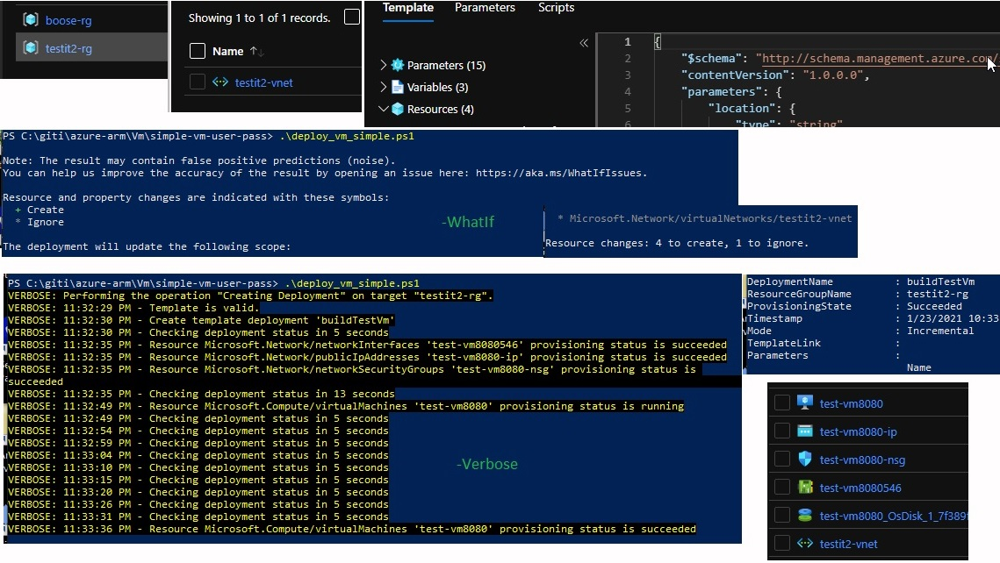

# Simple vm with username and password from script

## If you have a rg and a vnet, here is how to make a vm and include it the vnet with below mentioned installed and connect it to the vnet
## (Make it in the portal first, without creating it, just get to the finish step and download for automation.)

## 1 Resource group and vnet used: 
* testit2-rg
* testit2-vnet

## 1.1  A note about vnet:
## When you create or update a virtual network in your subscription, Network Watcher will be enabled automatically in your Virtual Network's region. There is no impact to your resources or associated charge for automatically enabling Network Watcher. With the vnet mentionedwe got the folowing resources:
[

## 2 The information provided in the Portal:

* Virtual machine name test-vm8080
* Availability zone, 1
* Ubuntu Server 18.04 LTS - GEN1
* Standard_BS1s - 1 vpcu, 1 gb memory A$12/mon
* Administrator account password
* Public inbound ports, allow SSH 22
* Disk standard, HDD
* Virtual net, testit-vnet
* Subnet default, 10.0.0.0/24
* Public ip, (new) test-vm-ip
* Public inbound ports, allow SHH 22
* Boot diagnostics, Disable
* extensions is empty now, will add when template works

## 3 Download the template and parameter for automation
## 3.1 Changes in the template, most important is described in the ps1 section
### (3.2 ) If you do not not want to change anything as described in 3.1, just provide a rg, templatefile, paramterfile and New-AzResourceGroupDeployment with just tha main paramters(rg, tempfile, paramfile and user + password):

## Ps1:
```ps1
# From the template file you download you get the virtual network id as:
"virtualNetworkId": {
            "type": "string"
        },
# From the parameter file you download you get the virtual network id as:
"virtualNetworkId": {
            "value": "/subscriptions/an-id-xxxxxx-x-x-x-x-x-x-x-x/resourceGroups/testit2-rg/providers/Microsoft.Network/virtualNetworks/testit2-vnet"
            
        },
# We changed it to get it dynamically:
# From the parameter file you download, we changed to:
 "virtualNetworkId": {
            "value": null
            
        },
# And feed it like this:
$sub = Get-AzSubscription
# [..]
# construct the virtualNetworkId (is has been removed from the downloaded parameter file used here)
$vnetId = "/subscriptions/" + $sub.Id +  "/resourceGroups/" + $resourceGr.ResourceGroupName + "/providers/Microsoft.Network/virtualNetworks/" +$vnet
```

## 4 Run deploy_vm_simple.ps1 for testing, change to -Verbose for actual deploy
```ps1
# template file
$templateFile = "C:\giti\azure-arm\Vm\simple-vm-user-pass\vm_template.json"
# parameter file
# [...]
$paramterFile = "C:\giti\azure-arm\Vm\simple-vm-user-pass\vm_paramters.json"
New-AzResourceGroupDeployment -Name buildTestVm `
  -ResourceGroupName $resourceGr.ResourceGroupName `
  -TemplateFile $templateFile -TemplateParameterFile $paramterFile `
  -adminUsername $userName -adminPassword $passWordSecure -WhatIf
```
## 4.1 Secure the password if not using keyvault
## 4.2 (TDB) Run deploy_vm_user_input.ps1 for testing, change to -Verbose for actual deploy

## 5  Verify the build
##  Open putty and connect
[

## 6 Build, steps and result
[
