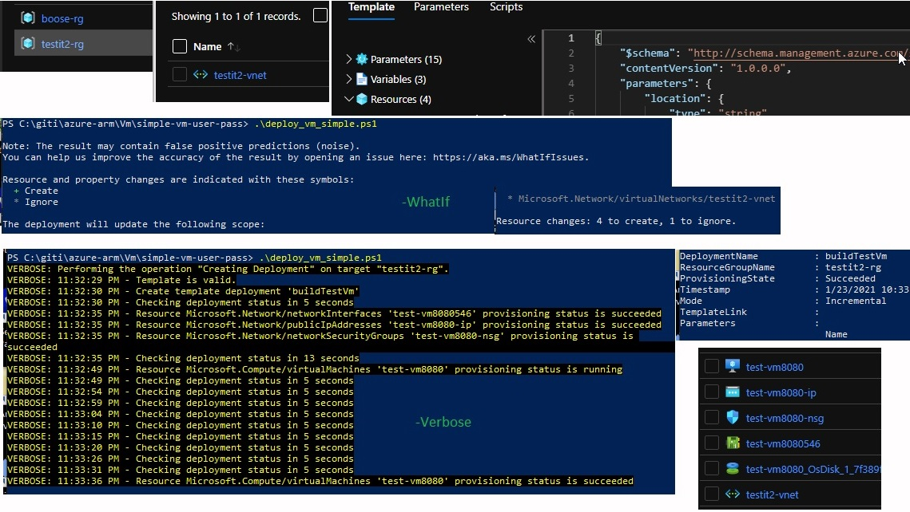

# Simple vm
### If you have a rg and a vnet, here is how to make a vm with the following installed:
#### (Make it in the portal first, without creating it, just get to the finish step and download for automation.)

### rg used, testit2-rg, vnet testit2-vnet


* Virtual machine name test-vm8080
* Availability zone, 1
* Ubuntu Server 18.04 LTS - GEN1
* Standard_BS1s - 1 vpcu, 1 gb memory A$12/mon
* Administrator account password
* Public inbound ports, allow SSH 22
* Disk standard, HDD
* Virtual net, testit-vnet
* Subnet default, 10.0.0.0/24
* Public ip, (new) test-vm-ip
* Public inbound ports, allow SHH 22
* Boot diagnostics, Disable
* extensions is empty now, will add when template works

#### Download the template and parameter for automation

#### Run deploy_vm_simple.ps1 for testing, change to -Verbose for actual deploy
```ps1 
New-AzResourceGroupDeployment -Name buildTestVm `
  -ResourceGroupName $resourceGr.ResourceGroupName `
  -TemplateFile $templateFile -TemplateParameterFile $paramterFile `
  -adminUsername $userName -adminPassword $passWordSecure -WhatIf
```
### Secure the password if not using keyvault
#### Run deploy_vm_user_input.ps1 for testing, change to -Verbose for actual deploy

###  Verify the build
####  Open putty and connect
[

# 
### Build and steps
[
